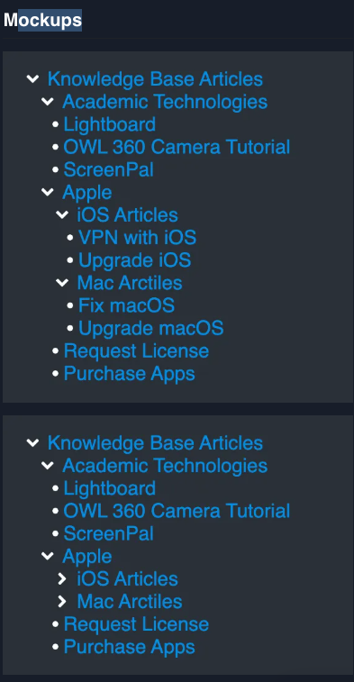

# Sidebar

## Problem Statement

**How to build a Confluence-like Sidebar with Tree Structure? | Atlassian
Frontend Interview Question | React.js**

In this question, the candidate needs to build a sidebar that contains a
collapsible tree-like UI.

**NOTE**: This question has been picked up from
[devtools.tech](https://devtools.tech/).

## Function Requirements

- The backend provides the data via an API.
- The menu should be collapsible.
- Each node should be a link.
- A node at any level can have children or be a leaf/terminal node.
- A node with children should have right carat icon when in closed state and
  down carat icon when in open state.
- Each level should be properly indented.
- Each node's text label color should be `#0097e6`. It should be underlined on
  hover.

## LICENSE

All code here is under MIT LICENSE, a copy of which can be found
[here](./LICENSE)
